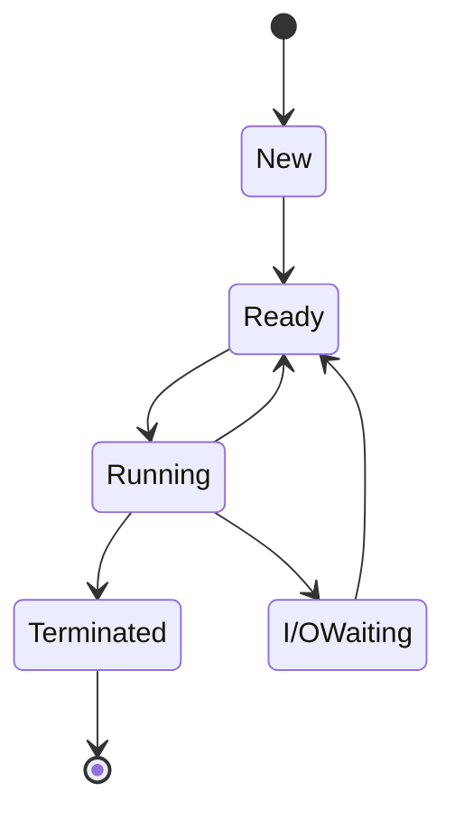
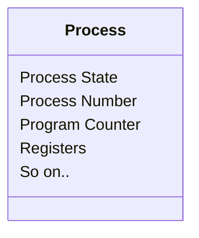

# Operating System
## Processes
### The Process
*Process* is  a program in execution sometimes its also known as the *text section*. It also include  a process stack for temporary data, data section for global variable and it may also include the heap memory which is allocated at runtime.

##### Process State
- **New** : The process is being created.
- **Running** :  Instructions are being executed.
- **Waiting** : The process is waiting for some event to occur(I / O event).
- **Ready** : The process is waiting to be assigned  to processor.
- **Terminated** : The process has finished executed.
##### Process Control Block
Each process is represented in the Operating System by a *Process Control Block*.
- **Process State** : The state may be new, ready, running, waiting, halted, and so on.
- **Program Counter** : The counter indicates the address  of the next instruction to be executed.
- **CPU Registers** : Accumulators, index registers, stack pointers and general purpose registers.

- **CPU Scheduling Info.** : This information includes the process priority, pointer to scheduling queues.
- **Memory-management information** : Value of the base and limit registers, the page tables, or the segment tables.
- **Accounting information** : This information includes the amount of CPU and real time used, time limits, account numbers, jobs or process numbers.
- **I/O status information** : List of I/O devices allocated to the process.
##### Thread
Threads are also known as light weight process. Process  is  a program that perform a single *thread* of execution.

### Process Scheduling
The Objective of the *multi-programming* is to have some process running at all times, to maximize CPU utilization. The objective of time sharing is to switch the CPU among processes so frequently that users can interact with each program.
##### Scheduling Queues
